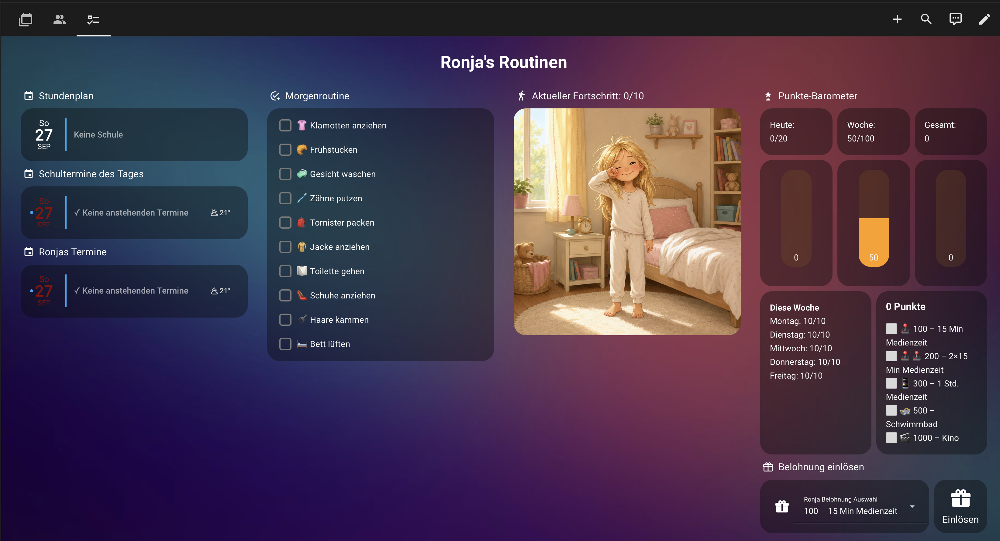

# Kinder-Routinen mit Live-Punktesystem für Home Assistant

🇩🇪 Deutsch · [🇬🇧 English](README.en.md)

[](https://my.home-assistant.io/redirect/hacs_repository/?owner=jacky-coke&repository=daily_routines&category=integration)

> Aus "hat sie die Zähne geputzt?" wird ein Dashboard, das von selbst mitzählt:
> jede pünktlich erledigte Aufgabe gibt sofort einen Punkt, die Woche läuft auf
> ein rundes Ziel, und der Fortschritt ist als Bild sichtbar – ganz ohne
> Zettel an der Kühlschranktür.

## Was diese Integration kann

- Ein **Einrichtungsassistent** fragt Kindname, Routinen (z. B. "Morgen",
  "Mittag") und die Aufgaben je Routine direkt ab. Keine To-Do-Liste muss
  vorher von Hand angelegt werden.
- Jede pünktlich (vor einer selbst gewählten Frist-Uhrzeit) abgehakte
  Aufgabe gibt **sofort** einen Punkt – nicht erst abends ausgewertet.
- Ein **Wochenzähler** (läuft montags auf 0 zurück) und ein **Punktekonto**
  (läuft nie zurück), gegen das später Belohnungen eingelöst werden können.
- Der Assistent schlägt am Ende automatisch ein "rundes" Wochenziel vor
  (z. B. 100 statt 87 Punkte) – optional ergänzt um Bonuspunkte für einen
  komplett fristgerechten Tag.
- Pro Aufgabe lässt sich optional ein **eigenes Bild** hochladen, dazu ein
  Grundbild und ein "Alles erledigt"-Bild. Das passende Bild wird automatisch
  angezeigt, sobald die jeweils letzte Aufgabe erledigt wurde.
- Direkt nach der Einrichtung entsteht automatisch ein **eigenes Dashboard**
  in der Seitenleiste – mit To-Do-Listen, Punkteanzeige und Fortschrittsbild.
  Kein manuelles Bauen von Karten nötig.
- Über **"Konfigurieren"** am Eintrag lässt sich später alles nachträglich
  anpassen: Routinen hinzufügen oder entfernen, Aufgaben bearbeiten, Bilder
  austauschen – ganz ohne Neueinrichtung.

## Warum dieses Projekt entstanden ist

Der Auslöser war eine ganz konkrete Situation bei uns zu Hause: Unsere
Tochter Ronja ist neurodivergent, und ihr fällt es morgens besonders schwer,
eine Sammelanweisung wie "Mach dich fertig" selbstständig in die einzelnen
nötigen Schritte zu zerlegen und der Reihe nach abzuarbeiten.

Dafür gibt es einen nachvollziehbaren Hintergrund. Das eigenständige Planen,
Starten und Durchhalten mehrstufiger Aufgaben gehört zu den sogenannten
**exekutiven Funktionen** – einer Gruppe kognitiver Fähigkeiten, zu denen
unter anderem Handlungsplanung, Aufgabeneinstieg ("Task-Initiation") und
Selbstorganisation zählen. Bei vielen neurodivergenten Kindern, etwa mit
ADHS oder im Autismus-Spektrum, sind genau diese Funktionen unterschiedlich
stark ausgeprägt (bekannt geworden ist dieses Erklärmodell vor allem durch
den ADHS-Forscher Russell Barkley). Eine Anweisung wie "Mach dich fertig"
bündelt für ein Kind mit solchen Schwierigkeiten unsichtbar sieben, acht
oder mehr Einzelschritte – jeder davon eine eigene kleine Entscheidung, an
der der ganze Ablauf hängen bleiben kann.

Ein in Pädagogik und Ergotherapie bewährter Ansatz dagegen ist die
sogenannte **Aufgabenanalyse** ("Task Analysis"): Eine komplexe Handlung
wird in einzelne, sichtbare und abhakbare Schritte zerlegt, kombiniert mit
unmittelbarer, positiver Rückmeldung nach jedem einzelnen Schritt. Genau
das bildet dieses Projekt technisch ab – eine klare, feste Aufgabenliste
statt einer vagen Gesamtanweisung, ein Punkt sofort nach jedem erledigten
Schritt statt erst abends, und ein Fortschrittsbild, das sichtbar macht,
wie nah das Ziel schon ist.

Wichtig ist mir dabei: Das hier ist ein Alltagswerkzeug, das eine bewährte
Strategie technisch unterstützt – keine Diagnostik und keine Therapie. Bei
Fragen zur individuellen Förderung lohnt sich immer das Gespräch mit
Kinderarzt, Ergotherapie oder dem schulischen Förderzentrum.

## So sieht es in der Praxis aus



Das ist Ronjas echtes, täglich genutztes Dashboard – links die abhakbare
Routine, in der Mitte das Fortschrittsbild, rechts das Punkte-Barometer.

**Wichtiger Hinweis:** Dieser Screenshot zeigt mein eigenes, gewachsenes
Dashboard und geht über das hinaus, was die Integration automatisch
anlegt. Zusätzlich verwendet werden dort:

- die HACS-Karte [`calendar-card-pro`](https://github.com/alexpfau/calendar-card-pro)
  für die Kalender-Kacheln ("Stundenplan", "Schultermine des Tages",
  "Ronjas Termine"),
- die Custom-Integration [`ms365_calendar`](https://github.com/RogerSelwyn/MS365-Calendar)
  ("Microsoft 365 – Calendar" von RogerSelwyn, über HACS) zur Anbindung des
  Microsoft-365-Kalenders für den Stundenplan,
- die HACS-Karte [`bar-card`](https://github.com/custom-cards/bar-card) für
  den vertikalen Balken-Stil des Punkte-Barometers,
- eine "Belohnung einlösen"-Auswahl samt Einlösen-Button – Teil meines
  eigenen, ursprünglich manuell gebauten Setups, **noch nicht** Teil dieser
  Integration (siehe [Roadmap](#roadmap)),
- eine eigene, individuell erstellte Bildserie als Fortschrittsbild (nicht
  Teil dieses Repos).

Die Integration selbst liefert eine schlichtere, aber sofort funktionierende
Basis ganz ohne diese Extras – Details dazu weiter unten.

## Installation

- In HACS → "Custom repositories" diese Repo-URL eintragen, Kategorie
  "Integration" (oder den Badge oben auf dieser Seite nutzen).
- Home Assistant neu starten.
- **Einstellungen → Geräte & Dienste → Integration hinzufügen → "Kinder-Routinen
  Punktesystem"** wählen – der Assistent führt Schritt für Schritt durch die
  Einrichtung: Kindname und Anzahl der Routinen, Aufgaben je Routine,
  optional Bilder je Aufgabe, zuletzt das Punktesystem.

Eine ausführliche Anleitung mit Screenshots zu jedem einzelnen Schritt des
Assistenten sowie zur nachträglichen Verwaltung gibt es in der
[README der Integration](custom_components/kinder_routinen/README.md).

## Voraussetzungen

- Home Assistant (getestet mit aktuellen 2026.x-Versionen)
- HACS, zur Installation der Integration

Keine weiteren Helfer, Automationen oder Custom Cards sind nötig – alles
Nötige richtet die Integration selbst ein.

## Aufbau dieses Repos

```
custom_components/kinder_routinen/   Die Integration selbst (siehe eigene README)
images/                              Beispiel-Dashboard-Screenshot (siehe oben)
```

## Roadmap

- Belohnungs-Auswahl und Einlösen-Button als native Bestandteile der
  Integration (aktuell noch manuell zu bauen, siehe Hinweis oben).
- Freitags-Wochenbericht mit Status je Wochentag.
- Vollständige englische Übersetzung auch der Integrations-Oberfläche
  (aktuell nur diese README).

## Lizenz

MIT – siehe [LICENSE](LICENSE). Mach damit, was du willst; eine Erwähnung
freut mich, ist aber keine Pflicht.
